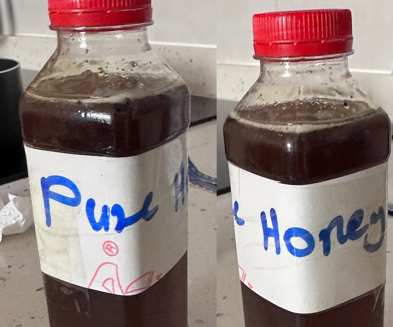
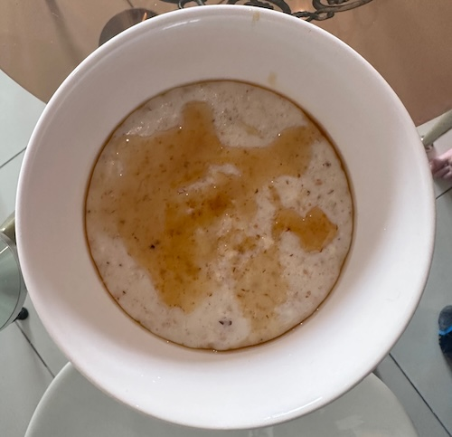
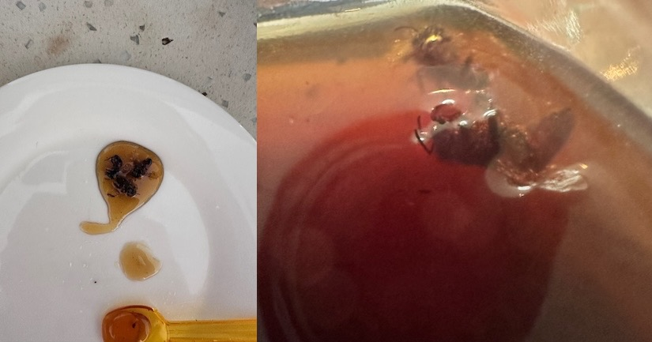

As with most places I've visited my experience is that eating the local food generally ends up being cheaper and tastier than trying to recreate your favourite dish from back home. Ghana can be quite dramtically true on this front (there's a post about sausages coming with some warnings). 

Honey is available widely in supermarkets, but keen to get closer to the real deal, I bought this 'pure honey' from a stall outside Shoprite on Oxford Street in Osu district. My bartering game on this occasion was fairly poor, as it had been a long day. The seller started at 30 Cedis and despite my classic nudge of 🤨 "... but is that your really your best price?" (eyebrows raised tall), she was not budging. To be totally honest for this sort of purchase, the bartering dance is generally performed simply because it's expected, I'm hardly breaking the bank at £1.50 for this tasty treat.

This is a runny honey, it pours smoothly out of the bottle, and so far there are no crystals. The colour is dark mahogany and the strong flavour is rich but also floral. One of the interesting things about honey from around the world is how the local plants affect the flavour. I'm not sure what strain of nectar these bees had been supping, but it has a rich almost fruity flavour, sweet to the point of being sickly if over-eaten.

Delicious on Porridge! Does that dribble look like anything to you?

Imagining a dark spirits to honey comb-parison, I'd put this with something heavy and a bit sweet like a Bourbon (I'm too ignorant of Bourbons name any in particular).

It came with some extra passengers in the bottle which are best removed before eating.

